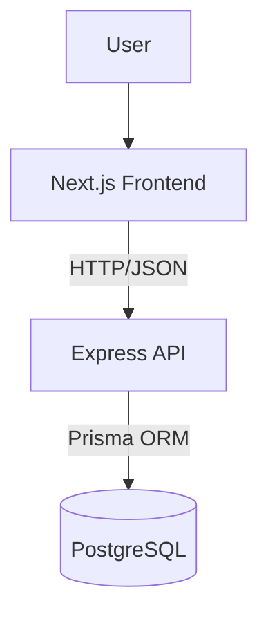

# BC Market Architecture

## Overview

**BC Market uses a modern full-stack monorepo architecture based on:**

- Next.js frontend application
- Express.js backend API
- PostgreSQL database
- npm workspaces monorepo structure

The project follows a layered architecture approach focused on scalability, maintainability, and clear separation of responsibilities.

---

## Monorepo Structure

BC Market uses a monorepo architecture managed with npm workspaces.

**The repository is organized as follows:**

```plaintext
bc-market/
│
├── apps/
│   ├── frontend/
│   └── backend/
│
├── docs/
│
├── package.json
├── package-lock.json
└── README.md
```

### apps/frontend

Contains the Next.js frontend application.

**Responsibilities:**

- User interface
- Client-side logic
- Authentication state
- API communication
- Pages and layouts

### apps/backend

Contains the Express.js backend API.

**Responsibilities:**

-Business logic
-Authentication
-Database access
-API endpoints
-Validation and middleware

### docs

Contains technical documentation related to the project architecture, workflows, and decisions.

---

## Backend Architecture

The backend follows a layered architecture pattern focused on separation of responsibilities and maintainability.

**Request flow:**

```plaintext
Routes
→ Controllers
→ Services
→ Database
```

The backend is organized into multiple layers, where each layer has a specific responsibility.

### Routes

Routes define the API endpoints and connect HTTP requests to controllers.

**Responsibilities:**

- Define endpoints
- Apply middlewares
- Forward requests to controllers

Routes should not contain business logic.

### Controllers

Controllers handle HTTP communication between the client and the application services.

**Responsibilities:**

- Receive requests
- Validate basic input
- Call services
- Return HTTP responses

Controllers should remain thin and avoid business logic.

### Services

Services contain the core business logic of the application.

**Responsibilities:**

- Business rules
- Authentication logic
- Data processing
- Application workflows

Services should be independent from HTTP details whenever possible.

### Database Layer

The database layer is responsible for communicating with PostgreSQL through Prisma ORM.

**Responsibilities:**

- Database queries
- Data persistence
- Entity access

---

## Backend Folder Structure

The backend source code is organized by responsibility.

```plaintext
src/
├── config/
├── controllers/
├── middlewares/
├── routes/
├── services/
├── lib/
├── utils/
├── types/
└── index.ts
```

### config

Application configuration files.

**Examples:**

- environment variables
- database configuration
- external services configuration
- controllers

### HTTP request handlers

Controllers receive requests, call services, and return responses.

### middlewares

Express middlewares used across the application.

**Examples:**

- authentication middleware
- error handling
- request logging
- routes

### API endpoint definitions

Routes connect HTTP endpoints with controllers.

### services(backend)

Business logic layer.

Services contain the core application logic and workflows.

### lib(backend)

Reusable internal libraries and shared integrations.

**Examples:**

- Prisma client instance
- JWT utilities
- external SDK setup

### utils(backend)

Small reusable helper functions.

Utilities should remain generic and stateless.

### types(backend)

Shared TypeScript types and interfaces.

### index.ts

Application entry point.

**Responsible for:**

- starting the Express server
- loading middlewares
- registering routes
- initializing the application

---

## Frontend Architecture

The frontend is built with Next.js using the App Router architecture.

The frontend is responsible for:

- Rendering the user interface
- Managing client-side interactions
- Handling navigation
- Communicating with the backend API
- Managing authentication state

The application follows a component-based architecture focused on reusability and separation of concerns.

---

## Frontend Folder Structure

The frontend application is organized using the Next.js App Router structure.

```plaintext
src/
├── app/
├── components/
├── services/
├── lib/
├── hooks/
├── types/
├── styles/
└── utils/
```

### app

Contains routes, layouts, and pages.

Managed by the Next.js App Router system.

### components

Reusable UI components.

**Possible organization:**

- ui/
- forms/
- auth/
- layout/

### services(frontend)

Frontend API communication layer.

**Responsible for:**

- API requests
- request abstraction
- backend communication

### lib(frontend)

Shared frontend libraries and integrations.

**Examples:**

- Axios instance
- authentication helpers
- external libraries setup

### hooks

Custom React hooks.

**Examples:**

- authentication hooks
- form hooks
- data fetching hooks

### types(frontend)

Shared frontend TypeScript types.

### styles

Global styles and styling configuration.

### utils(frontend)

Reusable helper functions.

---

## System Architecture Diagram



---

## API Communication

The frontend communicates with the backend through a REST API using HTTP requests and JSON data.

**Communication flow:**

```plaintext
Frontend
↓ HTTP Requests
Express API
↓
PostgreSQL
```

The backend exposes RESTful endpoints that are consumed by the frontend application.

**Example:**

```http
POST /api/auth/login
GET /api/products
POST /api/products
```

### Data Format

The API uses JSON as the standard data exchange format.

**Example response:**

```json
{
  "success": true,
  "data": {
    "id": 1,
    "name": "Product name"
  }
}
```

### HTTP Methods

**The API follows standard HTTP methods conventions:**

- GET → retrieve data
- POST → create resources
- PUT/PATCH → update resources
- DELETE → remove resources

### Authentication

Authentication will use JWT (JSON Web Tokens).

Authenticated requests will include the token in the Authorization header.

**Example:**

```http
Authorization: Bearer <token>
```

### Frontend Communication Layer

The frontend communicates with the backend through dedicated service modules.

**Example:**

```plaintext
services/auth.service.ts
services/products.service.ts
```

This approach centralizes API communication and avoids duplicating request logic across components.

---

## Database Architecture

BC Market uses PostgreSQL as the primary relational database.

The backend communicates with the database through Prisma ORM.

**Architecture flow:**

```plaintext
Services
↓
Prisma Client
↓
PostgreSQL
```

### PostgreSQL

**PostgreSQL is responsible for:**

- Data persistence
- Relationships between entities
- Transactions
- Query execution

The database stores the core business data of the application.

**Examples:**

- users
- products
- categories
- orders

### Prisma ORM

Prisma is used as the database ORM (Object Relational Mapper).

**Responsibilities:**

- Database queries
- Schema management
- Migrations
- Type-safe database access

Prisma acts as an abstraction layer between the application and PostgreSQL.

### Prisma Schema

**Database models are defined inside:**

```plaintext
prisma/schema.prisma
```

**The Prisma schema defines:**

- models
- relationships
- field types
- database mappings

### Migrations

Database changes are managed through Prisma migrations.

**Migrations ensure:**

- consistent database structure
- versioned schema changes
- reproducible environments

### Database Access

Database access should remain centralized through Prisma Client.

Services are responsible for coordinating business logic before interacting with the database.

---

## Authentication Strategy

BC Market uses JWT-based authentication for protecting private API routes and identifying authenticated users.

**Authentication flow:**

```plaintext
User Login
↓
Backend validates credentials
↓
JWT token generated
↓
Frontend stores authentication state
↓
Authenticated requests include token
```

### Authentication Process

1. The user submits credentials from the frontend.
2. The backend validates the credentials.
3. A JWT token is generated.
4. The frontend stores the authentication state.
5. Protected API requests include the authentication token.

### Protected Routes

Protected backend routes require authentication before access is granted.

**Examples:**

- product management
- order management
- admin actions

Authentication validation is handled through Express middlewares.

### Authorization Header

Authenticated requests use the Authorization header.

**Example:**

```http
Authorization: Bearer <token>
```

### Authentication Middleware

**Authentication middleware is responsible for:**

- validating JWT tokens
- rejecting unauthorized requests
- attaching user information to requests

### Frontend Authentication State

**The frontend is responsible for:**

- tracking authentication status
- handling login/logout
- protecting frontend routes
- managing authenticated requests

### Security Concerns

Sensitive operations and protected resources should always be validated on the backend.

Frontend protection alone is not considered secure.

---

## Environment Variables

BC Market uses environment variables for managing sensitive configuration and environment-specific values.

**Examples:**

- database connection strings
- JWT secrets
- API URLs
- application ports

Environment variables are stored in `.env` files and should never be committed to the repository.

### Backend Environment Variables

**Examples:**

```env
DATABASE_URL=
JWT_SECRET=
PORT=
```

**Responsibilities:**

- database configuration
- authentication secrets
- server configuration

### Frontend Environment Variables

Frontend environment variables are used for public configuration values required by the client application.

**Examples:**

```env
NEXT_PUBLIC_API_URL=
```

Only variables prefixed with NEXT_PUBLIC_ should be exposed to the browser.

### Security Considerations

Sensitive values must remain private and should only exist on the backend environment.

**Examples of sensitive data:**

- database credentials
- JWT secrets
- API private keys

These values should never be exposed to the frontend application.

### Environment Separation

Different environments may use different configurations.

**Examples:**

- development
- testing
- production

This separation helps maintain consistency and security across deployments.

---

## Development Workflow

BC Market follows a Git workflow focused on clean history, collaboration practices, and incremental development.

**Branch structure:**

```plaintext
main
└── develop
    └── feature/*
```

### main

Represents stable and production-ready states of the project.

This branch should remain protected and updated only through Pull Requests.

### develop

Primary integration branch for ongoing development.

New features are merged into this branch before reaching main.

### feature/*

Feature branches are used for isolated development work.

**Examples:**

- feature/auth-system
- feature/products-module
- feature/database-setup

### Pull Requests

All changes should be integrated through Pull Requests.

**Benefits:**

- cleaner history
- change review
- better traceability
- safer merges

### Merge Strategy

The project uses Squash and Merge as the primary merge strategy.

**Benefits:**

- simplified commit history
- cleaner project timeline
- easier navigation through changes

**Example:**

```plaintext
feat: setup backend architecture
```

instead of multiple temporary commits.

### Conventional Commits

Commit messages follow the Conventional Commits specification.

**Examples:**

```plaintext
feat: add authentication module
fix: resolve login validation issue
docs: update architecture documentation
chore: configure eslint
```

### Project Language

Technical communication inside the repository is written in English.

**Includes:**

- commits
- pull requests
- issues
- labels
- technical documentation

---

## Architectural Principles

BC Market follows a pragmatic architecture approach focused on maintainability, scalability, and progressive learning.

**The project prioritizes:**

- clear separation of responsibilities
- incremental complexity
- maintainable code structure
- consistent development workflows
- long-term scalability

### Avoiding Premature Overengineering

The architecture intentionally avoids unnecessary complexity during early development stages.

**Examples of intentionally postponed patterns:**

- microservices
- complex dependency injection systems
- event-driven architecture
- CQRS
- advanced repository abstractions

The project favors simplicity and clarity until additional complexity becomes necessary.

### Separation of Responsibilities

Each layer of the application has a clearly defined responsibility.

**Examples:**

- routes handle endpoint definitions
- controllers manage HTTP communication
- services contain business logic
- Prisma manages database access

**This separation improves:**

- maintainability
- readability
- scalability
- testability

### Scalability Through Structure

The project is designed to scale progressively without requiring major architectural rewrites.

**The monorepo structure allows future expansion such as:**

- admin panels
- mobile applications
- shared packages
- additional services

### Consistency First

**The project prioritizes consistency across:**

- folder structures
- naming conventions
- API design
- Git workflows
- documentation

Consistency improves long-term maintainability and developer experience.

### Documentation as Part of the Architecture

Technical documentation is considered part of the project architecture.

**Architectural decisions and workflows should remain documented to ensure:**

- project consistency
- easier onboarding
- long-term maintainability
- decision traceability

### Learning-Oriented Development

The project is also designed as a professional learning experience.

Decisions prioritize understanding architectural concepts and real-world workflows instead of rapidly adding features without structure.
