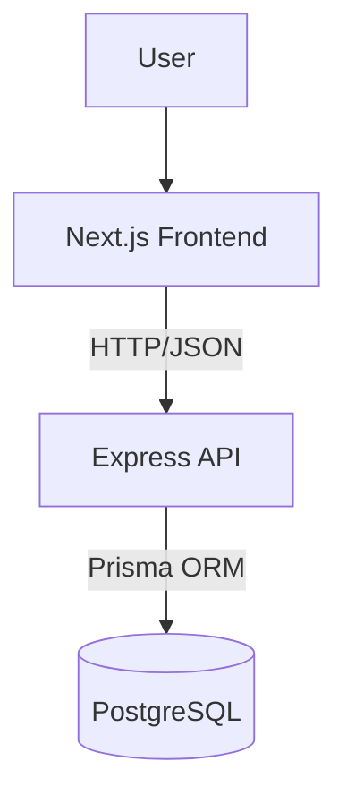

# BC Market Architecture

## Overview

**BC Market uses a modern full-stack monorepo architecture based on:**

- Next.js frontend application
- Express.js backend API
- PostgreSQL database
- npm workspaces monorepo structure

The project follows a layered architecture approach focused on scalability, maintainability, and clear separation of responsibilities.

---

## Monorepo Structure

BC Market uses a monorepo architecture managed with npm workspaces.

**The repository is organized as follows:**

```plaintext
bc-market/
│
├── apps/
│   ├── frontend/
│   └── backend/
│
├── docs/
│
├── package.json
├── package-lock.json
└── README.md
```

### apps/frontend

Contains the Next.js frontend application.

**Responsibilities:**

- User interface
- Client-side logic
- Authentication state
- API communication
- Pages and layouts

### apps/backend

Contains the Express.js backend API.

**Responsibilities:**

-Business logic
-Authentication
-Database access
-API endpoints
-Validation and middleware

### docs

Contains technical documentation related to the project architecture, workflows, and decisions.

---

## Backend Architecture

The backend follows a layered architecture pattern focused on separation of responsibilities and maintainability.

**Request flow:**

```plaintext
Routes
→ Controllers
→ Services
→ Database
```

The backend is organized into multiple layers, where each layer has a specific responsibility.

### Routes

Routes define the API endpoints and connect HTTP requests to controllers.

**Responsibilities:**

- Define endpoints
- Apply middlewares
- Forward requests to controllers

Routes should not contain business logic.

### Controllers

Controllers handle HTTP communication between the client and the application services.

**Responsibilities:**

- Receive requests
- Validate basic input
- Call services
- Return HTTP responses

Controllers should remain thin and avoid business logic.

### Services

Services contain the core business logic of the application.

**Responsibilities:**

- Business rules
- Authentication logic
- Data processing
- Application workflows

Services should be independent from HTTP details whenever possible.

### Database Layer

The database layer is responsible for communicating with PostgreSQL through Prisma ORM.

**Responsibilities:**

- Database queries
- Data persistence
- Entity access

---

## Backend Folder Structure

The backend source code is organized by responsibility.

```plaintext
src/
├── config/
├── controllers/
├── middlewares/
├── routes/
├── services/
├── lib/
├── utils/
├── types/
└── index.ts
```

### config

Application configuration files.

**Examples:**

- environment variables
- database configuration
- external services configuration
- controllers

### HTTP request handlers

Controllers receive requests, call services, and return responses.

### middlewares

Express middlewares used across the application.

**Examples:**

- authentication middleware
- error handling
- request logging
- routes

### API endpoint definitions

Routes connect HTTP endpoints with controllers.

### services(backend)

Business logic layer.

Services contain the core application logic and workflows.

### lib(backend)

Reusable internal libraries and shared integrations.

**Examples:**

- Prisma client instance
- JWT utilities
- external SDK setup

### utils(backend)

Small reusable helper functions.

Utilities should remain generic and stateless.

### types(backend)

Shared TypeScript types and interfaces.

### index.ts

Application entry point.

**Responsible for:**

- starting the Express server
- loading middlewares
- registering routes
- initializing the application

---

## Frontend Architecture

The frontend is built with Next.js using the App Router architecture.

The frontend is responsible for:

- Rendering the user interface
- Managing client-side interactions
- Handling navigation
- Communicating with the backend API
- Managing authentication state

The application follows a component-based architecture focused on reusability and separation of concerns.

---

## Frontend Folder Structure

The frontend application is organized using the Next.js App Router structure.

```plaintext
src/
├── app/
├── components/
├── services/
├── lib/
├── hooks/
├── types/
├── styles/
└── utils/
```

### app

Contains routes, layouts, and pages.

Managed by the Next.js App Router system.

### components

Reusable UI components.

**Possible organization:**

- ui/
- forms/
- auth/
- layout/

### services(frontend)

Frontend API communication layer.

**Responsible for:**

- API requests
- request abstraction
- backend communication

### lib(frontend)

Shared frontend libraries and integrations.

**Examples:**

- Axios instance
- authentication helpers
- external libraries setup

### hooks

Custom React hooks.

**Examples:**

- authentication hooks
- form hooks
- data fetching hooks

### types(frontend)

Shared frontend TypeScript types.

### styles

Global styles and styling configuration.

### utils(frontend)

Reusable helper functions.

---

## System Architecture Diagram


