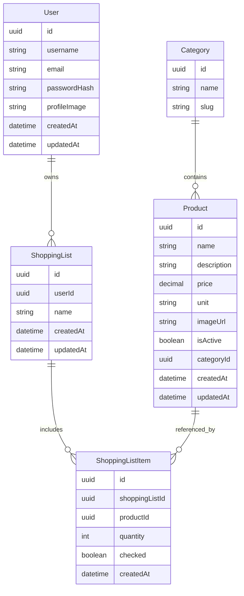

# Entity Relationship Diagram (ERD)

This diagram represents the core database structure of BC Market, including users, shopping lists, products, categories, and their relationships.

## Diagram

## Notes

- Shopping lists are the core domain entity of the application.
- Product prices are reference-based and not tied to real-time inventory.
- Shopping list totals are calculated dynamically.
