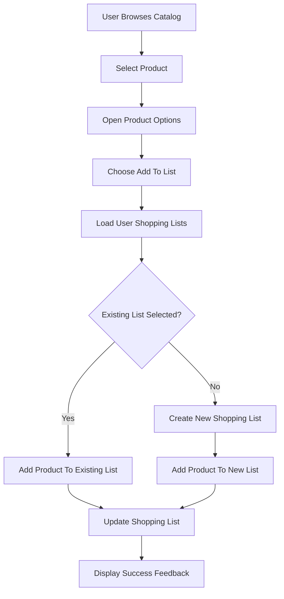

# Add Product To List Flow

This diagram represents the process of adding a product from the catalog to an existing shopping list or creating a new list during the process.

## Diagram

```mermaid
flowchart TD

    A[User Browses Catalog]

    B[Select Product]

    C[Open Product Options]

    D[Choose Add To List]

    E[Load User Shopping Lists]

    F{Existing List Selected?}

    G[Add Product To Existing List]

    H[Create New Shopping List]

    I[Add Product To New List]

    J[Update Shopping List]

    K[Display Success Feedback]


    A --> B

    B --> C

    C --> D

    D --> E

    E --> F

    F -->|Yes| G

    G --> J

    F -->|No| H

    H --> I

    I --> J

    J --> K
```
