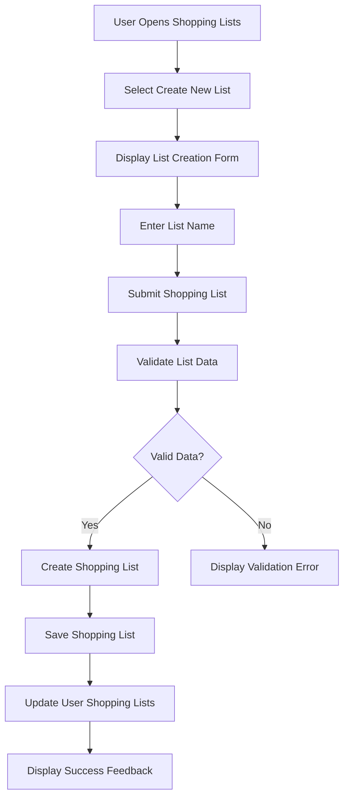

# Create Shopping List Flow

This diagram represents the process of creating a new shopping list in BC Market.

## Diagram

```mermaid
flowchart TD

    A[User Opens Shopping Lists]

    B[Select Create New List]

    C[Display List Creation Form]

    D[Enter List Name]

    E[Submit Shopping List]

    F[Validate List Data]

    G{Valid Data?}

    H[Create Shopping List]

    I[Save Shopping List]

    J[Update User Shopping Lists]

    K[Display Success Feedback]

    X[Display Validation Error]


    A --> B

    B --> C

    C --> D

    D --> E

    E --> F

    F --> G

    G -->|Yes| H

    H --> I

    I --> J

    J --> K

    G -->|No| X
```
