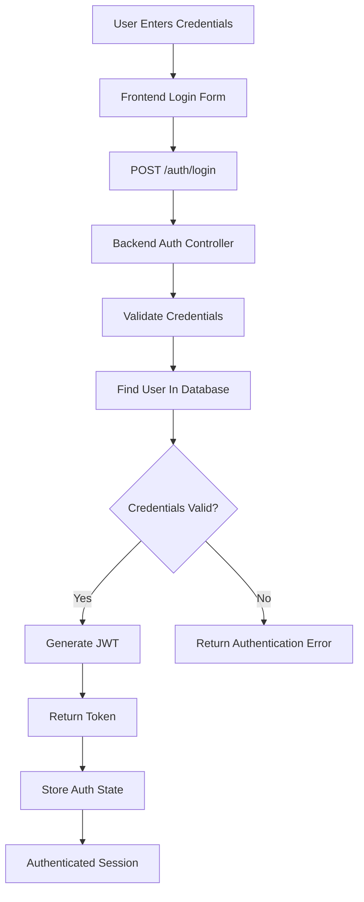

# Login Flow

This diagram represents the login authentication process in BC Market, including credential validation, JWT generation, and authenticated session handling.

## Diagram

```mermaid
flowchart TD

    A[User Enters Credentials]

    B[Frontend Login Form]

    C[POST /auth/login]

    D[Backend Auth Controller]

    E[Validate Credentials]

    F[Find User In Database]

    G{Credentials Valid?}

    H[Generate JWT]

    I[Return Token]

    J[Store Auth State]

    K[Authenticated Session]

    X[Return Authentication Error]


    A --> B

    B --> C

    C --> D

    D --> E

    E --> F

    F --> G

    G -->|Yes| H

    H --> I

    I --> J

    J --> K

    G -->|No| X
```
