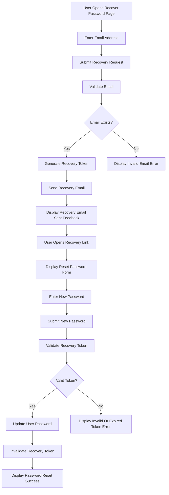

# Recover Password Flow

This diagram represents the password recovery process in BC Market, including email validation, recovery token generation, and password reset.

## Diagram

```mermaid
flowchart TD

    A[User Opens Recover Password Page]

    B[Enter Email Address]

    C[Submit Recovery Request]

    D[Validate Email]

    E{Email Exists?}

    F[Generate Recovery Token]

    G[Send Recovery Email]

    H[Display Recovery Email Sent Feedback]

    I[User Opens Recovery Link]

    J[Display Reset Password Form]

    K[Enter New Password]

    L[Submit New Password]

    M[Validate Recovery Token]

    N{Valid Token?}

    O[Update User Password]

    P[Invalidate Recovery Token]

    Q[Display Password Reset Success]

    X[Display Invalid Email Error]

    Y[Display Invalid Or Expired Token Error]


    A --> B

    B --> C

    C --> D

    D --> E

    E -->|Yes| F

    F --> G

    G --> H

    H --> I

    I --> J

    J --> K

    K --> L

    L --> M

    M --> N

    N -->|Yes| O

    O --> P

    P --> Q

    E -->|No| X

    N -->|No| Y
```
