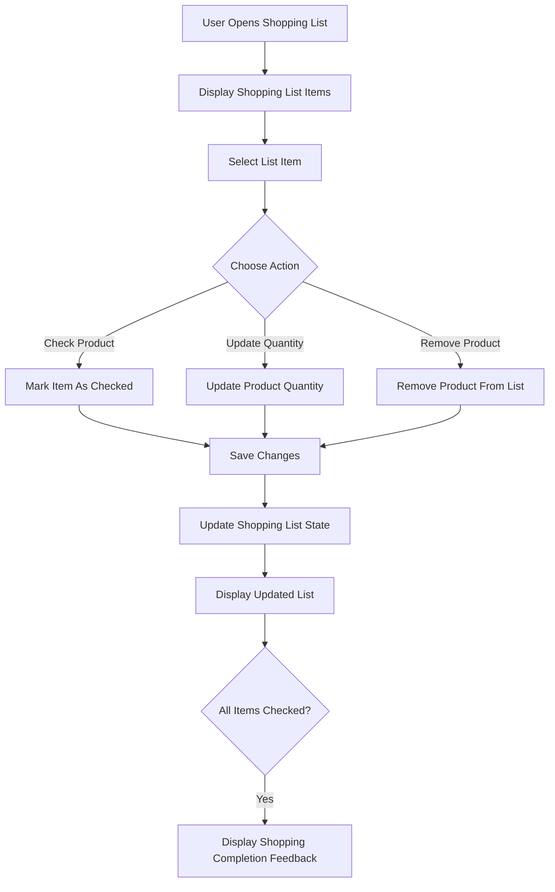

# Shopping Session Flow

This diagram represents the shopping session experience in BC Market, where users interact with their shopping lists while shopping in-store.

## Diagram

```mermaid
flowchart TD

    A[User Opens Shopping List]

    B[Display Shopping List Items]

    C[Select List Item]

    D{Choose Action}

    E[Mark Item As Checked]

    F[Update Product Quantity]

    G[Remove Product From List]

    H[Save Changes]

    I[Update Shopping List State]

    J[Display Updated List]

    K{All Items Checked?}

    L[Display Shopping Completion Feedback]


    A --> B

    B --> C

    C --> D

    D -->|Check Product| E

    D -->|Update Quantity| F

    D -->|Remove Product| G

    E --> H

    F --> H

    G --> H

    H --> I

    I --> J

    J --> K

    K -->|Yes| L
```
