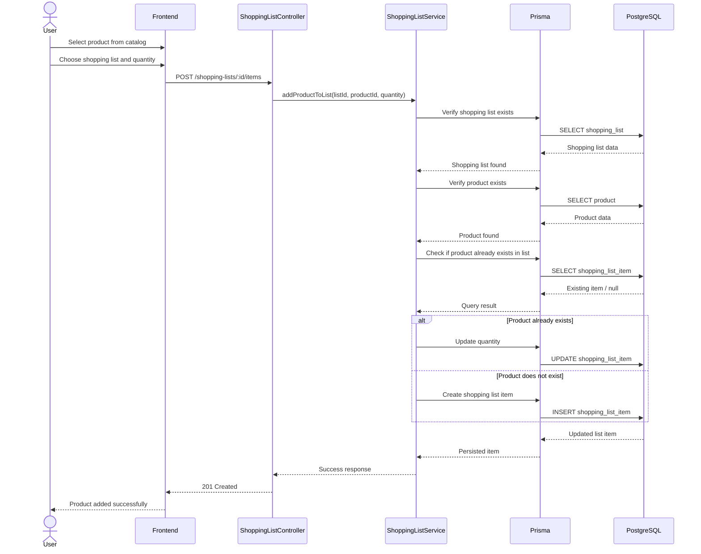

# Add Product To List Sequence Diagram

This diagram represents the process of adding a product from the catalog into a shopping list in BC Market, including frontend interaction, backend validation, duplicate item handling, and database persistence.

## Diagram

