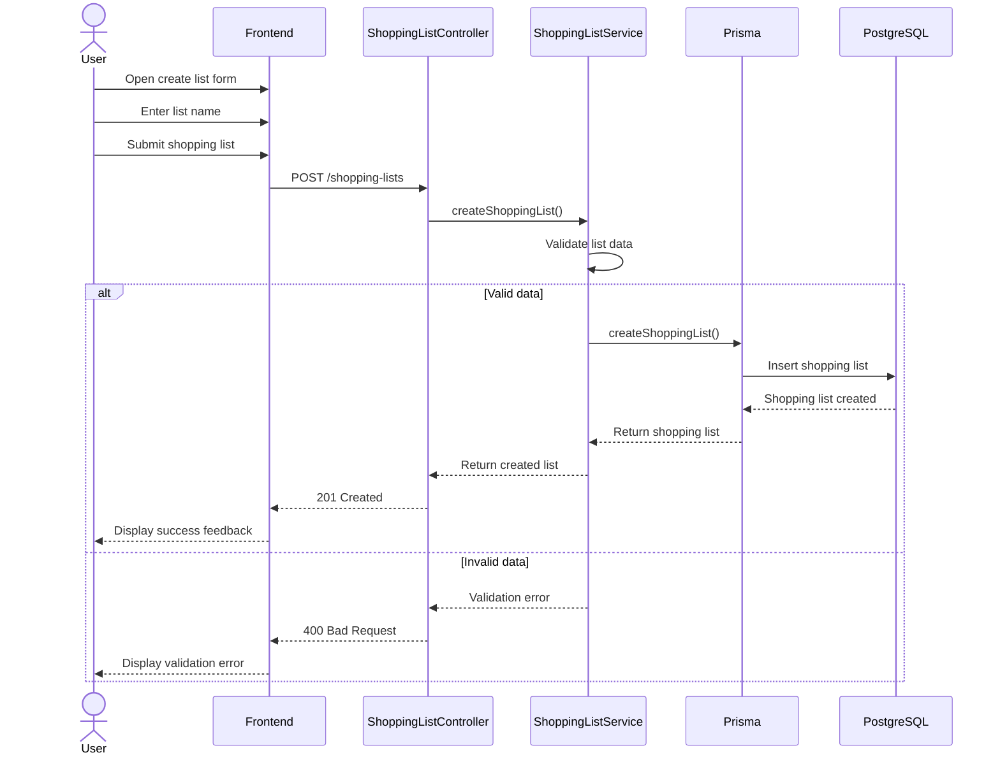

# Create Shopping List Sequence Diagram

This diagram represents the process of creating a new shopping list in BC Market, including frontend interaction, backend validation, and database persistence.

## Diagram

