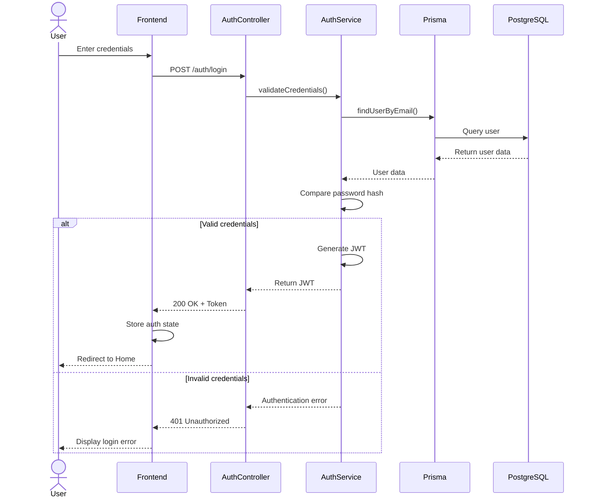

# Login Sequence Diagram

This diagram represents the authentication sequence in BC Market, including frontend interaction, backend validation, JWT generation, and authenticated session handling.

## Diagram

