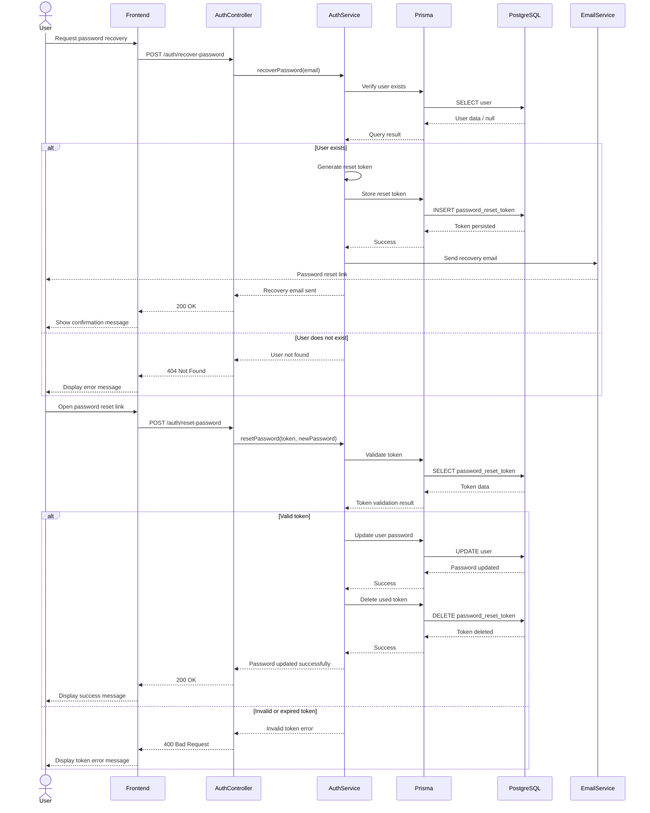

# Recover Password Sequence Diagram

This diagram represents the password recovery process in BC Market, including email verification, reset token generation, email delivery, password update, and database persistence.

## Diagram

