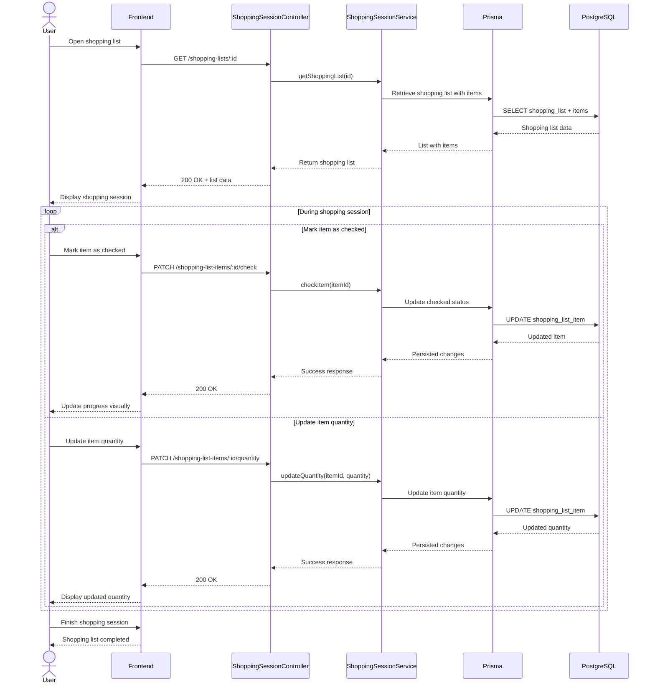

# Shopping Session Sequence Diagram

This diagram represents the shopping session process in BC Market, where the user interacts with a shopping list during a physical store visit, including list retrieval, item checking, quantity updates, and persistence of shopping progress in the database.

## Diagram

